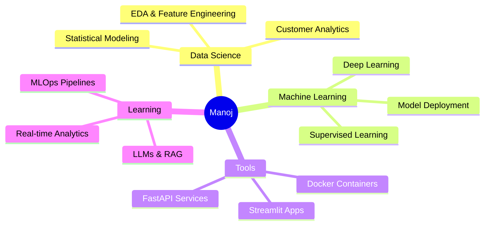

<div align="center">


<a href="https://www.linkedin.com/in/y-manoj-441216298/">
  
</a>
<a href="https://github.com/ymanoj7745-lgtm">
  
</a>


<br/><br/>
```python
class Manoj:
    name       = "Y. Manoj"
    roles      = ["Data Scientist", "ML Engineer", "Python Developer"]
    languages  = ["Python", "R", "SQL"]
    frameworks = ["TensorFlow", "PyTorch", "Scikit-learn", "Streamlit", "FastAPI"]
    databases  = ["MySQL", "PostgreSQL", "MongoDB"]
    cloud      = ["Google Cloud", "AWS (basics)"]
    currently  = "Building churn intelligence systems for European banking"
    fun_fact   = "I let data do the talking 📊"
```

</div>

---

## 🧠 About Me

- 🔭 Currently working on **Customer Churn Intelligence** for European retail banking
- 🌱 Deep-diving into **LLMs, MLOps, and real-time data pipelines**
- 💡 Passionate about turning raw data into **actionable business decisions**
- 🎯 Goal: Build production-grade ML systems that create measurable impact
- ⚡ Fun fact: I believe **engagement beats demographics** in predicting churn

---

## 🚀 Featured Project

<a href="https://github.com/ymanoj7745-lgtm/european-bank-churn-analysis">
  
</a>

> 🏦 **European Bank Churn Analysis** — Behavioral segmentation, RSI scoring, and a live Streamlit dashboard across 10,000 customers in France, Germany & Spain.

---

## 💻 Tech Stack

### 🐍 Languages


### 🤖 Machine Learning & AI


### 📊 Data Science & Visualization


### 🌐 Web & API Frameworks


### 🗄️ Databases


### ☁️ Cloud & MLOps


### 🛠️ Dev Tools & Environment


---

## 📊 GitHub Stats

<div align="center">


</div>

---

## 📈 Contribution Graph


---

## 🏆 GitHub Trophies

<div align="center">

</div>

---

## 💡 Data Science Skills Radar
```
Machine Learning     ████████████████████  Expert
Data Visualization   ███████████████████░  Advanced
Deep Learning        ██████████████████░░  Advanced
NLP                  █████████████████░░░  Intermediate+
MLOps / Deployment   ████████████████░░░░  Intermediate
Cloud (GCP/AWS)      ███████████████░░░░░  Intermediate
Computer Vision      ██████████████░░░░░░  Intermediate
SQL / Databases      ███████████████████░  Advanced
```

---

## 🎯 Current Focus


---

<div align="center">

### 💬 Random Dev Quote


---


[](https://visitcount.itsvg.in)

*Proudly crafted with data, coffee & curiosity ☕*

</div>
