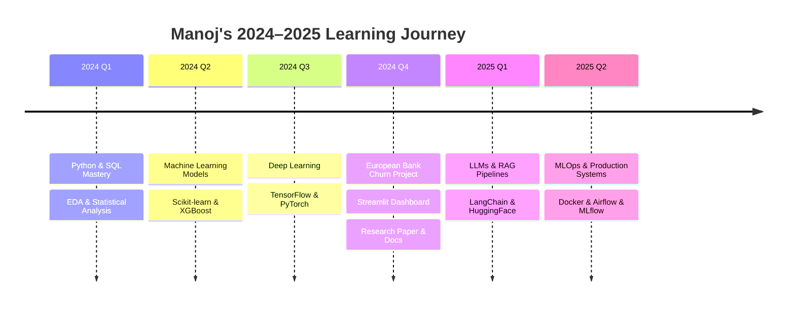

<div align="center">


</div>

<!-- Typing animation -->
<div align="center">
  
</div>

<br/>

<!-- Social badges -->
<div align="center">
  <a href="https://www.linkedin.com/in/y-manoj-441216298/">
    
  </a>
  <a href="https://github.com/ymanoj7745-lgtm">
    
  </a>
  
  
</div>

<br/>

---

<!-- Animated banner divider -->


##  &nbsp; About Me


```python
#!/usr/bin/env python3
# -*- coding: utf-8 -*-

from dataclasses import dataclass, field
from typing import List

@dataclass
class Manoj:
    """
    Data Scientist | ML Engineer | Python Developer
    ─────────────────────────────────────────────────
    Turning messy data into clean decisions since 2022.
    """

    name:         str  = "Y. Manoj"
    location:     str  = "India 🇮🇳"
    email:        str  = "ymanoj7745@gmail.com"

    roles: List[str] = field(default_factory=lambda: [
        "🧠 Data Scientist",
        "⚙️  ML Engineer",
        "🐍 Python Developer",
        "📊 Analytics Engineer",
    ])

    stack: dict = field(default_factory=lambda: {
        "languages"  : ["Python", "R", "SQL", "Bash"],
        "ml_ai"      : ["TensorFlow", "PyTorch", "Scikit-learn",
                        "XGBoost", "HuggingFace", "LangChain"],
        "data"       : ["Pandas", "NumPy", "Spark", "dbt"],
        "viz"        : ["Plotly", "Seaborn", "Matplotlib", "Power BI"],
        "web"        : ["Streamlit", "FastAPI", "Flask", "Django"],
        "databases"  : ["PostgreSQL", "MySQL", "MongoDB", "Redis"],
        "cloud"      : ["GCP", "AWS", "Docker", "MLflow"],
        "tools"      : ["Git", "Jupyter", "VS Code", "Airflow"],
    })

    currently_building: str = "🏦 Churn Intelligence System — European Bank"
    learning_next:      str = "🤖 LLMs, RAG pipelines & real-time MLOps"
    open_to:            str = "💼 Data Science & ML Engineering roles"

    fun_facts: List[str] = field(default_factory=lambda: [
        "📊 I let data do the talking",
        "🔍 I find patterns where others see noise",
        "☕ Fuelled by coffee and curiosity",
        "🚀 Deployment > Notebooks",
    ])

    def __post_init__(self):
        print(f"Hello World! I'm {self.name} 👋")
        print(f"Currently: {self.currently_building}")

if __name__ == "__main__":
    me = Manoj()
```

<br clear="right"/>

---


##  &nbsp; GitHub Stats

<div align="center">


</div>

---


## 🏆 GitHub Trophies

<div align="center">

</div>

---


##  &nbsp; Tech Stack

### 🐍 Languages
<div align="center">


</div>

### 🤖 Machine Learning & AI
<div align="center">


</div>

### 📊 Data & Visualization
<div align="center">


</div>

### 🌐 Web & API
<div align="center">


</div>

### 🗄️ Databases
<div align="center">


</div>

### ☁️ Cloud & MLOps
<div align="center">


</div>

### 🛠️ Dev Tools
<div align="center">


</div>

---


## 📈 Skill Proficiency

<div align="center">

| Domain | Skill | Proficiency |
|--------|-------|-------------|
| 🐍 Python | Core + OOP + Libraries | `██████████████████░░` 90% |
| 📊 Data Analysis | EDA, Feature Engineering | `█████████████████░░░` 85% |
| 🤖 Machine Learning | Supervised / Unsupervised | `████████████████░░░░` 80% |
| 🧠 Deep Learning | CNN, RNN, Transformers | `██████████████░░░░░░` 70% |
| 📉 Data Visualization | Plotly, Power BI, Seaborn | `████████████████████` 90% |
| 🗄️ SQL & Databases | Query, Design, Optimize | `█████████████████░░░` 85% |
| ☁️ Cloud & MLOps | GCP, Docker, MLflow | `████████████░░░░░░░░` 60% |
| 💬 NLP | Text Classification, RAG | `██████████████░░░░░░` 70% |

</div>

---


## 🎯 Current Focus & Roadmap


---


## 🚀 Featured Projects

<div align="center">

<a href="https://github.com/ymanoj7745-lgtm/european-bank-churn-analysis">
  
</a>

</div>

---


## 🐍 Contribution Snake

<div align="center">
  <picture>
    <source media="(prefers-color-scheme: dark)" srcset="https://raw.githubusercontent.com/ymanoj7745-lgtm/ymanoj7745-lgtm/output/github-snake-dark.svg"/>
    <source media="(prefers-color-scheme: light)" srcset="https://raw.githubusercontent.com/ymanoj7745-lgtm/ymanoj7745-lgtm/output/github-snake.svg"/>
    
  </picture>
</div>

---


## 💬 Dev Quote of the Day

<div align="center">
  
</div>

---

<div align="center">


**💜 Thanks for visiting! Drop a ⭐ if you find something useful.**

[](https://visitcount.itsvg.in)

</div>
